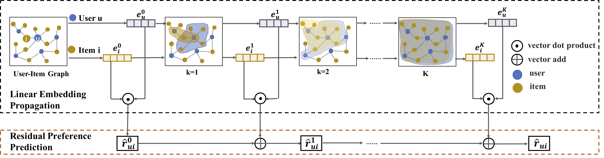

# LR-GCCF-AAAI20
Revisiting Graph based Collaborative Filtering: A Linear Residual Graph Convolutional Network Approach




Graph Convolutional Networks (GCNs) are state-of-the-art graph based representation learning models by iteratively stacking multiple layers of convolution aggregation operations and non-linear activation operations. Recently, in Collaborative Filtering (CF) domain, by treating the user-item interaction behavior as a bipartite graph, some researchers model the higher-layer collaborative signals with GCNs to alleviate the data sparsity issue in CF, and show superior performance compared to traditional works. However, these GCN based recommendation models suffer from the complexity and training difficulty with non-linear activations for large user-item graphs, and usually could not model deep layers of graph convolutions due to the over smoothing problem in the iterative process. In this paper, we revisit these graph based collaborative filtering models from two aspects. First, we empirically show that removing non-linearities would enhance recommendation performance, which is consistent with the theories in simple graph convolutional networks. Second, we propose a residual network structure that is specifically designed for CF with user-item interaction modeling, which alleviates the over smoothing problem in graph convolution aggregation operation with sparse data. The proposed model is a linear model and it is easy to train, scales to large datasets, and yields better efficiency and effectiveness on two real datasets.

We provide PyTorch implementations for LR-GCCF model.

**Note**: The current software works well with PyTorch 1.1.0

## Prerequisites

- PyTorch
- Python 3.5
- CPU or NVIDIA GPU + CUDA CuDNN

## Getting Started

### Installation

- Clone this repo:

```bash
git clone https://github.com/newlei/LR-GCCF.git
cd LR-GCCF
cd code
```

### Dataset

- Our datasets: 
  > Under the data folder ('cd ./data')
  >
  > Any problem: please seed mail to me <chenlei.hfut@gmail.com>.
  >
- Make self datasets: 
  > Favor <user,item> matrix,  e.g.:<1,2> denotes that user(id:1) favors item(id:2) 
  >  

### Train/test

- Train a model:

```python
#!./LR-GCCF/code
cd LR-GCCF
cd code
#for amazon dataset
python train_amazon.py
#for gowalla dataset
python train_gowalla.py
```

- Test a model:

```python
#!./LR-GCCF/code
cd LR-GCCF
cd code
#for amazon dataset
python test_amazon.py
#for gowalla dataset
python test_gowalla.py
```


### Note: the results of NGCF in our paper
*Why is there a big gap between the NGCF results in the paper and the original NGCF?* Since many researcher have consulted this issue, we explain here.

In short, the calculated NDCG in the original NGCF is not consistent with the original NDCG. We have fixed it and show the correct results. So there a big gap in the results of NGCF.

NDCG=DCG/IDCG. The maximum possible DCG is called Ideal DCG (IDCG), in other words, IDCG is the DCG value of the best ranking function on a dataset. so for a specific user in test data, the best ranking is unique, then the IDCG is unchanging. However, in NGCF [code](https://github.com/xiangwang1223/neural_graph_collaborative_filtering), the IDCG is changing. The calculation of the dcg_max(IDCG) depends on parameters r, but r is not the best ranking and will change according to the predicted of the model. Thus, the results of NGCF are based on a wrong implementation of NDCG.

You also can refer to the [link](https://github.com/xiangwang1223/neural_graph_collaborative_filtering/issues/34) and [link](https://github.com/kuandeng/LightGCN/issues/1) is the follow-up work of NGCF authors, this link also explains problem of NDCG.

**Note**: If you have questions about NGCF, please contact the author of NGCF or create github issues under the official code~[link](https://github.com/xiangwang1223/neural_graph_collaborative_filtering).


## Citation 
If you find this useful for your research, please kindly cite the following two papers
that crawal and analyze the data.

```
@article{LRGCCF2019,
  title={Revisiting Graph based Collaborative Filtering: A Linear Residual Graph Convolutional Network Approach},
  author={Lei, Chen and Le, Wu and  Richang, Hong and Kun, Zhang and Meng, Wang}
  journal={AAAI},
  year={2019}
}

```

Besides, you may find these following works are useful for understanding social recommendation.
```
@article{evolveSNS2017,
  title={Modeling the evolution of users’ preferences and social links in social networking services},
  author={Wu, Le and Ge, Yong and Liu, Qi and Chen, Enhong and Hong, Richang and Du, Junping and Wang, Meng},
  journal={IEEE Transactions on Knowledge and Data Engineering},
  volume={29},
  number={6}, 
  pages={1240--1253},
  year={2017},
  publisher={IEEE}
}


@inproceedings{arse2018,
  title={Attentive recurrent social recommendation},
  author={Sun, Peijie and Wu, Le and Wang, Meng},
  booktitle={The 41st International ACM SIGIR Conference on Research \& Development in Information Retrieval},
  pages={185--194},
  year={2018},
  organization={ACM}
}


@inproceedings{DiffNet2019,
  title={A Neural Influence Diffusion Model for Social Recommendation},
  author={Wu, Le and Sun, Peijie and  Fu, Yanjie and Hong, Richang and Wang, Xiting and Wang, Meng},
  booktitle={The 42st International ACM SIGIR Conference on Research \& Development in Information Retrieval},
  year={2019},
  organization={ACM}
}
```


## Acknowledgments
We thank LMC lab..


 
